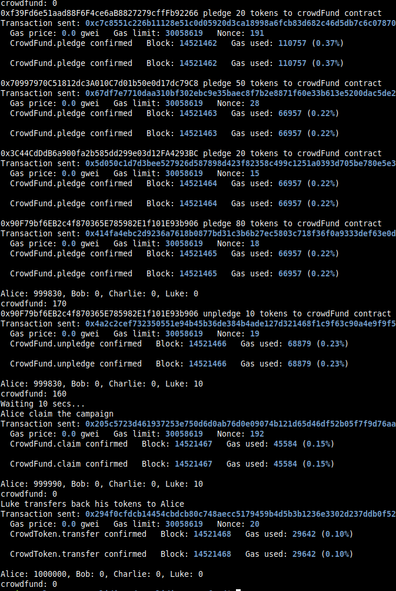

Study case of the CrowdFund contract, from [Solidity by Example Site, CrowdFund](https://solidity-by-example.org/app/crowd-fund/)

I use brownie to compile and deploy into hardhat in order to have the console.log feature.
You should start the hardhat node in another terminal and folder (`hh node`), then, in a terminal :

```bash
brownie compile
brownie run scripts/deploy.py
```

Crowd-Funding, creating a campaign, pledging/unpledging and claiming the campaign.
Deploying from brownie :

