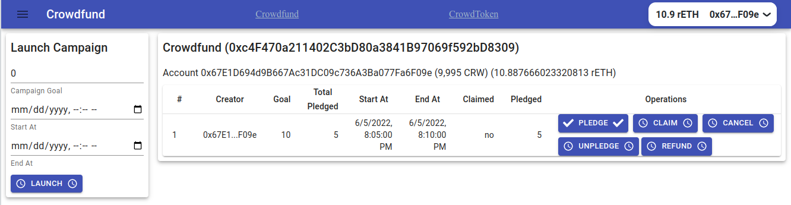

# Client Application for the Crowdfund contract

## client application on Rinkeby testnet

https://crowdfundfullstack.netlify.app/



## Quickstart

### `npm install`

To install the required packages.

### `configure .env`

Configure .env file in the client folder.
An example of .env file :

```bash .env
GENERATE_SOURCEMAP=false
REACT_APP_ALCHEMY_ID="your-api-key"
```

### `start the application`

```bash
npm start
```

Runs the app in the development mode.\
Open [http://localhost:3000](http://localhost:3000) to view it in your browser.
